# Active Ankle Prosthesis

**A powered ankle prosthesis built by four engineering students in Cairo, from parts bought off the shelf.**

<table>
<tr>
<td width="33%" align="center">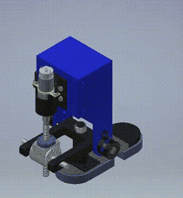</td>
<td width="33%" align="center">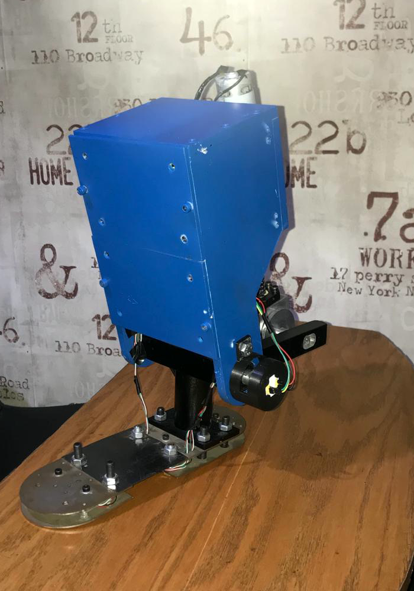</td>
<td width="33%" align="center">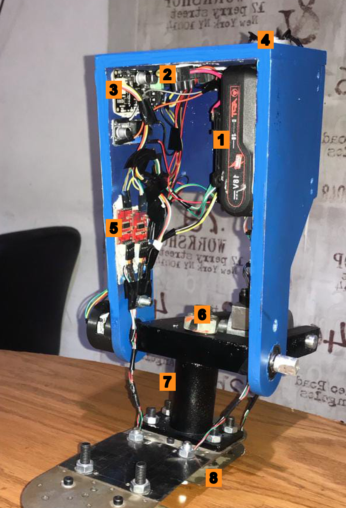</td>
</tr>
<tr>
<td align="center"><i>As designed</i></td>
<td align="center"><i>As built</i></td>
<td align="center"><i>Side panel off</i></td>
</tr>
</table>

Inside the frame: **1** 18 V drill battery · **2** battery power connector · **3** small regulator board off the battery leads (exact chip not identified from the photo) · **4** RS-550S motor · **5** HX711 load-cell amplifiers · **6** ball screw nut · **7** shin housing, ball screw inside · **8** foot plate, load cells underneath, AS5600 encoder wiring at the joint

> **Archived academic project, 2021.** This was our B.Sc. graduation project in Mechatronics Engineering at the Arab Academy for Science, Technology & Maritime Transport (AASTMT), Cairo. It is kept here as a record of the work. Nobody maintains it, and it is not a medical device.

A DC motor turns a ball screw, which drives the ankle joint. Load cells in the foot tell the controller which part of the gait cycle the wearer is in, and the ankle follows a reference angle trajectory to match.

The project won a sponsorship scholarship from the **Academy of Scientific Research and Technology (ASRT)**, Egypt.

---

## Why we built it

Most below-knee amputees in the MENA region walk on passive prostheses, which amount to a spring and a hinge. A passive ankle returns some energy but generates none of its own. Stairs, slopes and long walks therefore cost the wearer far more effort, and years of asymmetric gait bring problems of their own.

Active ankles are sold commercially. Between import duties and regional pricing, they are out of reach for nearly every amputee here.

So we asked a narrow question: could we build one locally, from parts available locally, at a price that made sense locally? Everything in the components list below was bought off the shelf in Cairo, and the motor came out of a cordless drill.

---

## How it works

Control is split into two layers, the way the team's own presentation laid it out: a high-level **state machine** decides which part of the gait cycle the wearer is in, and a low-level **PID loop** drives the motor to reach the angle that phase calls for.

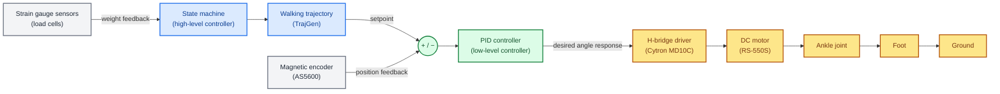

Reading it as a cycle:

1. **Where is the wearer in their step?** The strain gauges under the foot report weight distribution as heel and toe contact. That feeds the state machine, which is entirely what decides the gait phase, not a timer.
2. **What angle should the ankle be at?** The trajectory generator plays the segment of the reference walking trajectory that belongs to that phase, one sample at a time. Each sample is the setpoint.
3. **Get there.** The PID controller compares the setpoint against the measured position and drives the motor through the H-bridge. The output is the desired angle response, turned into PWM and a direction.
4. **Measure and repeat.** The magnetic encoder closes the position loop; the strain gauges keep telling the state machine where the next phase begins.

Every one of those steps runs as its own FreeRTOS task, so sensing, planning and control run concurrently rather than in one polling loop.

This diagram carries the same boxes, arrows and labels as the team's original control-strategy diagram (from the final presentation, slides 32 and 36) — recoloured for legibility and with one typo fixed (**"STRAIN GAUGES SESNORS"** → **SENSORS**). No wording or logic was changed. It checks out exactly against the firmware: `toe_cells`/`heel_cells` set `heel_state`/`toe_state`, `TrajGen` is the state machine picking a trajectory segment from those two booleans, and `pid_control.cpp` is the summing junction and PID block driving the Cytron driver.

### The gait cycle it targets

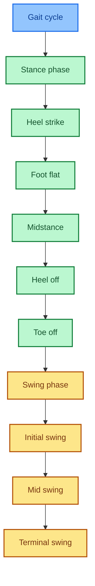

Per the team's presentation, one full gait cycle averages 0.98–1 s: roughly 0.59–0.67 s of stance and 0.38–0.42 s of swing (about a 60/40 split, in line with published gait figures). Our own hardware takes about 5 seconds to play through the same trajectory — see [Limitations](#what-worked-and-what-didnt) for why.

<details>
<summary><b>Sensing, feedback and why an ESP32</b></summary>

**Where the sensors actually are**, from the team's own photos rather than a schematic:

<table>
<tr>
<td width="50%">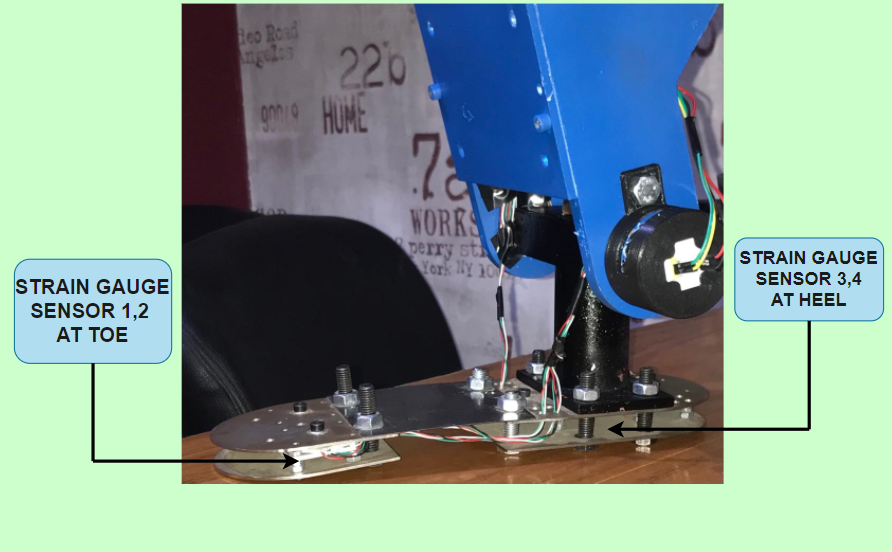</td>
<td width="50%">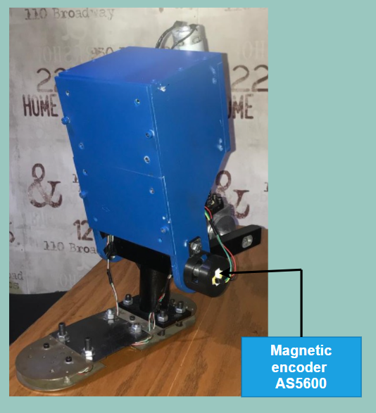</td>
</tr>
<tr>
<td align="center"><i>Strain gauge sensors 1–2 at the toe, 3–4 at the heel</i></td>
<td align="center"><i>AS5600 magnetic encoder, mounted at the joint</i></td>
</tr>
</table>

**Why ESP32 over the first Uno board**, from the presentation's own reasoning:

- Sufficient I/O: 2 GPIO per load cell × 4 load cells = 8 pins, 1 PWM + 1 digital for the motor driver, 2 I²C pins for the AS5600 — 12 pins in total
- WiFi and Bluetooth on-board
- 32-bit core vs. the Uno's 8-bit ATmega328
- 12-bit ADC vs. the Uno's 10-bit
- Up to 16-bit hardware PWM vs. the Uno's 8-bit `analogWrite`

One number here is worth a caveat: the presentation cites the ESP32 running at **160 MHz, "10x faster than an Arduino Uno"** (16 MHz × 10 = 160). The chip's commonly published maximum is **240 MHz** (about 15x the Uno) — 160 MHz is a real, selectable clock speed on this hardware, just not its ceiling, so "10x" understates it if the board was left at its default. Separately, the firmware's own PWM only uses 8-bit resolution (`LEDC_TIMER_13_BIT` is set to `8`, a leftover name from an earlier attempt) even though the chip can do more — the "16-bit" figure above is what the ESP32 is capable of, not what this project's motor PWM actually uses.

</details>

---

## The ankle tracking a gait cycle

This is a recording of the live telemetry, not of the ankle itself. The traces are joint position together with `heel_state` and `toe_state`, so it shows the controller working through a full cycle with contact detection running — the full system, state machine and PID loop together.

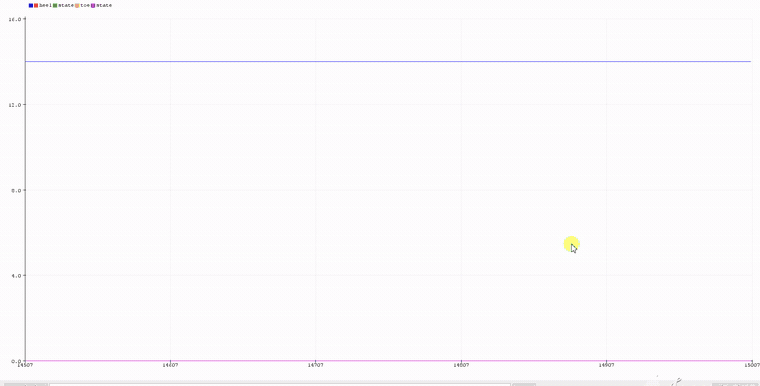

The original screen capture is at [`media/demo/gait-cycle-demo.webm`](media/demo/gait-cycle-demo.webm). GitHub will not play it inline from a repository path, so it downloads rather than streams, which is why the GIF is here instead.

The hardware it was recorded from is pictured at the top of this page. This is also the same recording behind the "Results of state machine" slide in the team's final presentation — same COM port, same timestamp, same window, matched frame for frame.

### A second recording that didn't survive

The presentation's "Control results" slide shows a different plot: `Target`, `Actual` and `PIDOut` traced over several repeated step cycles, from a separate session on the same machine and the same day. That is the trajectory-tracking demonstration on its own, without the gait-phase gating shown above. Only a still frame of it survived into the exported presentation file — the underlying video is not embedded in the `.pptx`, and it is not anywhere else on this machine either. We searched the entire project folder, Downloads, Videos, and OneDrive for it and came up empty.

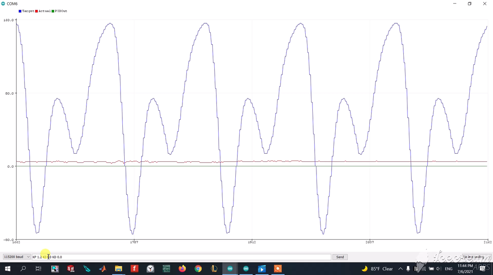

If that original recording turns up somewhere, it belongs here as a second GIF alongside the one above.

---

## Components

### Actuation

| Part | Role |
|---|---|
| RS-550S brushed DC motor | Drives the joint. Taken from a cordless drill: we could not source a brushless motor with the torque-to-size ratio we wanted within the budget. |
| Cytron MD10C H-bridge | Motor driver, 10 A continuous, driven by a PWM pin and a direction pin. |
| SFU1605 ball screw and nut | Converts motor rotation into the linear travel that moves the joint. |
| SKF 6002 bearing | Carries the ankle joint. |
| 18 V Li-ion pack, 1200 mAh | Supplies the motor, and the logic rail through a step-down regulator. |

Motor and ball screw figures, from the graduation book:

| Property | Value |
|---|---|
| Motor nominal voltage | 18 V DC (operating range 3-24 V) |
| Motor no-load speed | 22,000 rpm |
| Motor no-load current | 0.9 A |
| Motor stall current | 62 A |
| Motor peak efficiency | 8 A, 103 W output |
| Screw diameter | 16 mm (13 mm root) |
| Screw lead | 5 mm per revolution |
| Screw length | 400 mm |
| Screw material | Steel alloy, 147 MPa permissible strength |

The screw was sized against an approximate 1500 N design load and checked for buckling as a fixed-supported column over a 130 mm span. That calculation and the Inventor FEA (Von Mises stress, displacement, contact pressure) are worked through in the graduation book.

The drill motor is the root of most of the limitations further down this page.

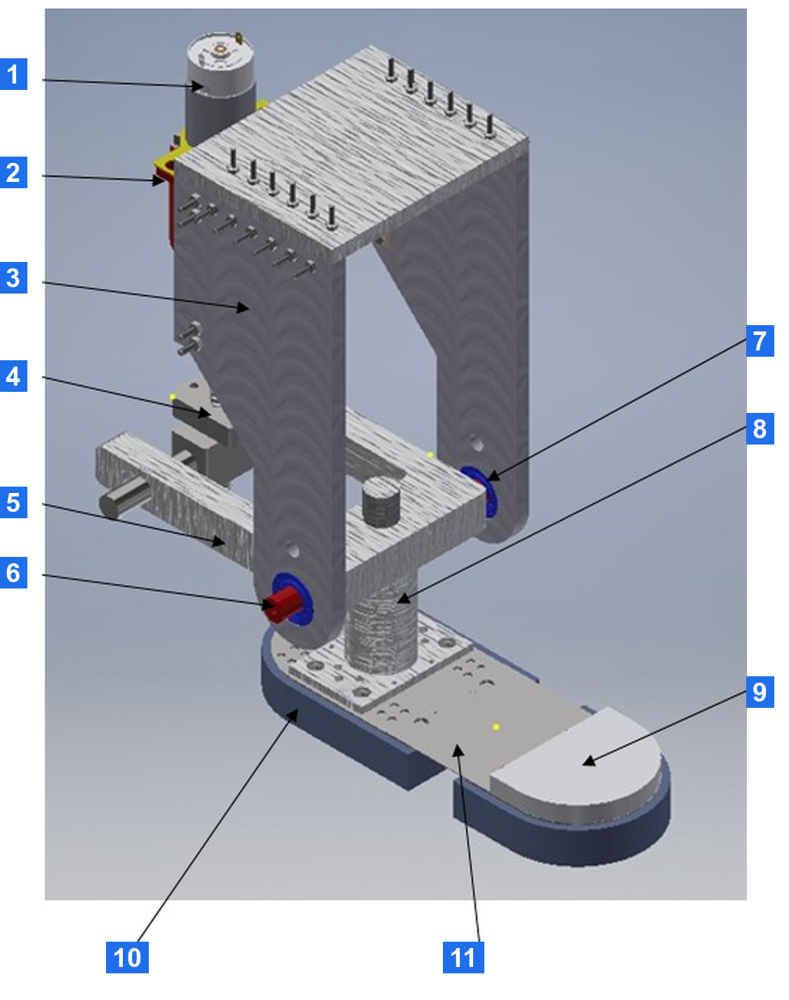

| | | | |
|---|---|---|---|
| **1** Motor | **4** Ball screw nut | **7** Bearing | **10** Heel |
| **2** Motor holder | **5** Lower link | **8** Foot shaft | **11** Spring sheet |
| **3** Support | **6** Lower link shaft | **9** Fore foot | |

Opened up, the drivetrain and the foot look like this:

<table>
<tr>
<td width="50%">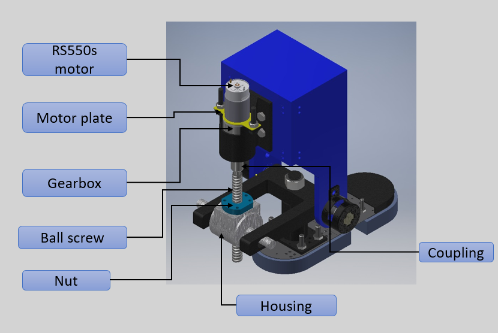</td>
<td width="50%">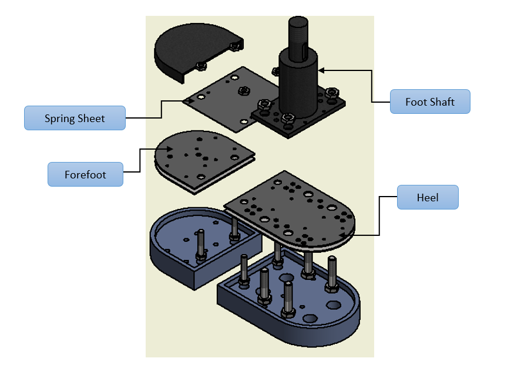</td>
</tr>
<tr>
<td align="center"><i>Motor, gearbox, ball screw and nut</i></td>
<td align="center"><i>Foot, exploded</i></td>
</tr>
</table>

### Sensing

| Part | Role |
|---|---|
| AS5600 magnetic rotary encoder (I²C, 12-bit) | Joint position. Absolute within one turn; firmware counts revolutions for multi-turn travel. |
| 50 kg full-bridge load cells | Ground contact. Four of them: two under the toe, two under the heel. |
| HX711 24-bit ADC | One amplifier per load cell, so four. |
| ACS712 current sensor, 30 A | Motor current. Used in the first design and on the test bench; it is not in the final ESP32 wiring or firmware. |

Toe and heel contact read together identify the gait phase, whether that is heel strike, flat foot, toe off or swing. That is what tells the controller where the wearer is in the cycle, rather than assuming it from a timer.

### Control electronics

| Part | Role |
|---|---|
| ESP32-WROOM-32 | The controller on the assembled ankle. Chosen over the first board for the extra I/O the four load cells needed, the clock speed, and onboard WiFi. |
| ATmega328 board | Ran the motor test bench while the ankle was being machined: motor, H-bridge, encoder and PID tuning. |
| Step-down regulator | Logic rail off the 18 V pack: 3.3 V for the ESP32, 5 V in the first design. |

### Wiring

The first design was built around an Uno board (ATmega328); we moved to an ESP32 partway through, for the extra I/O, the speed and the WiFi. Both diagrams survive, which makes the migration easy to see:

**First design, Uno board:**

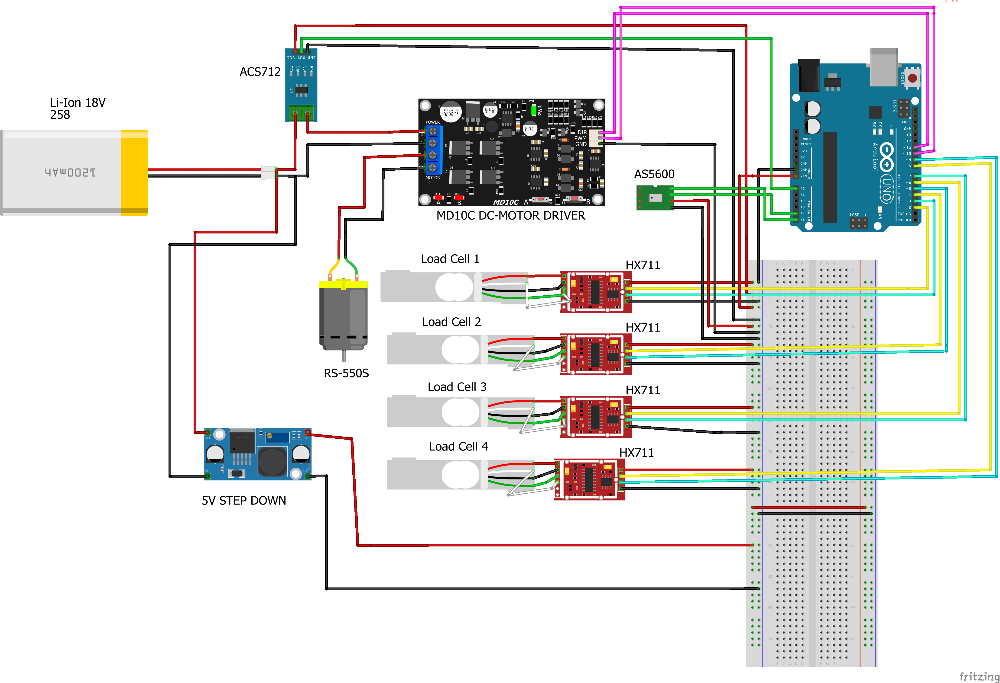

**Final design, ESP32:**

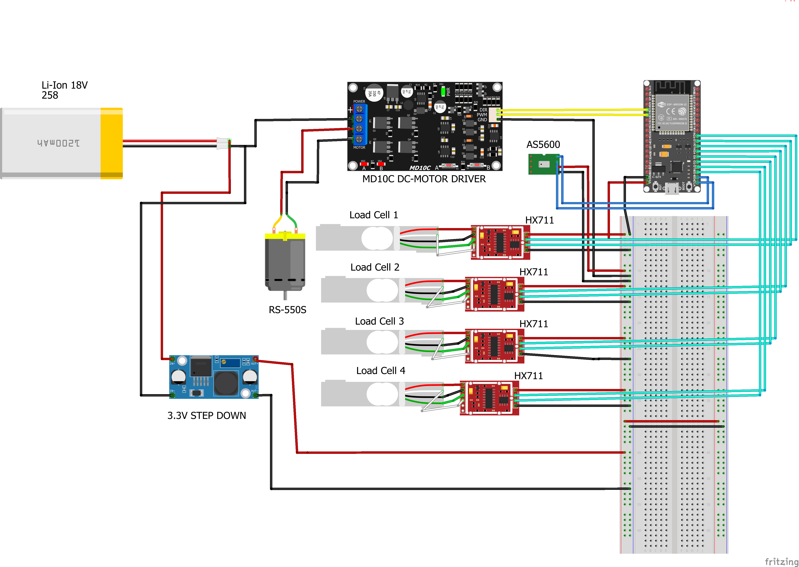

The ESP32 build drops the ACS712 from the loop and swaps the 5 V regulator for a 3.3 V one. Everything else carries over.

---

## Control system

An **ESP32** runs the controller as concurrent **FreeRTOS** tasks (using `TridentTD_EasyFreeRTOS32`), one task per job:

```
TrajGen        steps through the reference trajectory, advancing on gait phase
read_ANGLE     reads the AS5600, counts revolutions, applies the zero offset
pid            PID position loop; drives motor PWM and direction
toe_cells      2x HX711, toe contact, threshold 400
heel_cells     2x HX711, heel contact, threshold 400
Communication  serial telemetry and live gain tuning
```

The position loop is an ordinary **PID** on joint angle, tuned empirically to **Kp = 0.14, Ki = 0.2, Kd = 0**.

`TrajGen` picks which part of the cycle to play from the two contact booleans:

| heel | toe | phase |
|---|---|---|
| 1 | 0 | heel strike, moving to flat foot |
| 1 | 1 | flat foot, moving to heel off |
| 0 | 1 | heel off, moving to toe off |
| 0 | 0 | swing |

A latch flag per phase makes each segment play once per step instead of restarting while the contact state holds.

### About the code

It is written in a procedural C style: plain functions, global state, no classes of our own. It compiles as **C++**, because the framework core and every library it uses (`PID_v1`, `HX711_ADC`, `AS5600`, `WiFi`) are C++ and are used as objects.

We built it in the **Arduino IDE**, chosen because it is free, open source and got out of the way while we were bringing hardware up. It compiles `.ino` as C++ behind the scenes, which is why the original files never had to say so.

[`firmware/ankle_controller_esp32/`](firmware/ankle_controller_esp32) holds the same code with its structure made explicit: shared state in a header, one task per source file, and a PlatformIO config so it builds from the command line. The original sketches are archived untouched in [`firmware/original-sketches/`](firmware/original-sketches).

### The test bench came first

None of the control work waited for the mechanical build. While the ankle was still being machined, we put a bench together with just the motor, the H-bridge and the encoder, and developed against that.

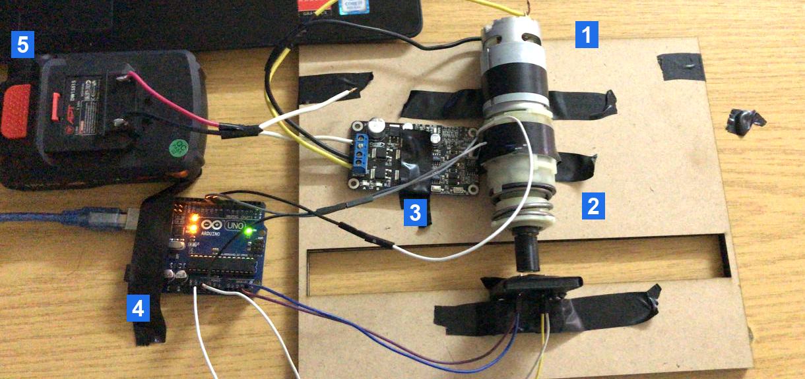

**1** RS-550S motor · **2** ball screw and coupling · **3** Cytron MD10C driver · **4** ATmega328 board · **5** 18 V drill battery

[`firmware/original-sketches/motor-test-bench/`](firmware/original-sketches/motor-test-bench) is that work, and the sketches read as the sequence we actually went through.

<details>
<summary><b>The bring-up sequence, sketch by sketch</b></summary>

| Stage | Sketches |
|---|---|
| Encoder alone, magnet detection and angle read | `encoder_angle` |
| Encoder driving the motor through the H-bridge | `read_angle_with_motor` |
| Current sensing, standalone then under load | `CURRENT_SENSOR`, `CURRENT_SENSOR_motor` |
| Load cell characterisation | `Read_1x_load_cell_renewed` |
| Moving to an RTOS, one concern per task | `FreeRTOS_sketch`, `testing_encoder_with_rtos`, `target_angle_and_printing` |
| PID under the scheduler | `rtos_with_pid`, `rtos_with_pid_library` |
| Position control, then position plus current | `pid_position_control_code`, `pid_position_control_current_code` |
| Full bench controller with the gait trajectory | `FINAL_PID_CODE_WITH_RTOS` |

</details>

By the time the assembled ankle existed, the loop was already tuned and the gains were known. The move to the ESP32 and the load cell array came after that, on a controller we already trusted.

### Tuning it

We tuned by hand over the serial link. The setpoint was a square wave between 0 and 150 counts, and we changed one gain at a time and watched the response. Green is the setpoint, blue the measured position, red the PID output.

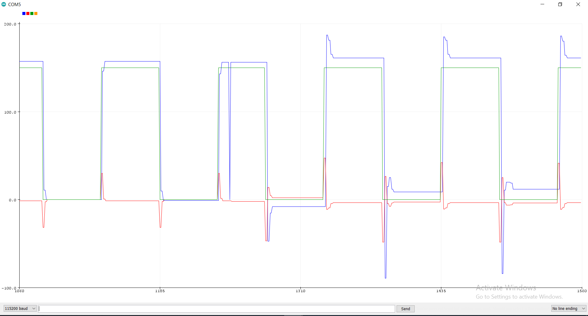

<details>
<summary><b>The rest of the sweep</b></summary>

**Kp = 0.1.** The response settles below the setpoint and never closes the gap:

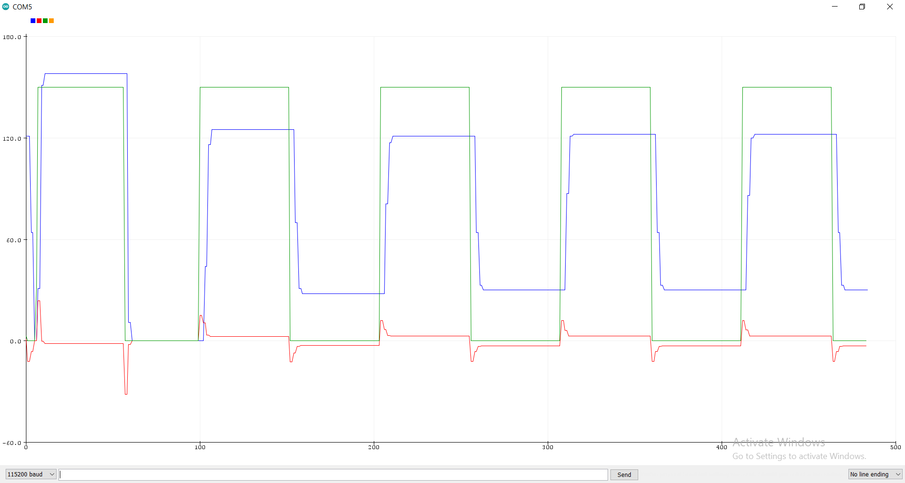

**Kp = 0.1 against 0.2:**


Raising Kp closes the steady-state gap and brings overshoot with it. The integral term, settling at Ki = 0.2, is what removed the remaining offset.

</details>

<details>
<summary><b>Current sensing on the bench</b></summary>

ACS712 output during bring-up, reading roughly 73.94 mA at rest against a 2503 mV reference, with a step to 147.88 mA under load:

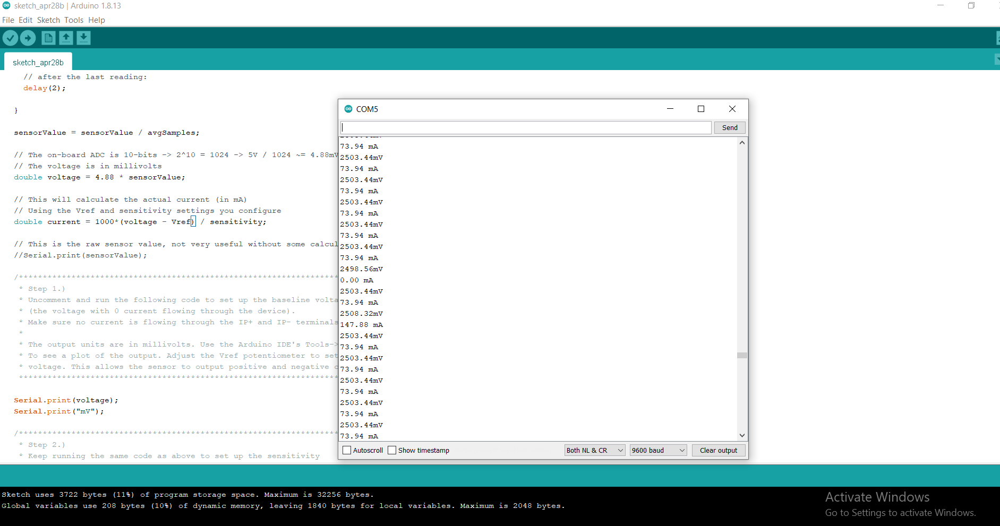

This was used to characterise the motor and choose the duty ceiling. It did not make it into the final ESP32 build.

</details>

### About the trajectory units

`WalkingTraj[101]` holds the reference trajectory: 101 samples covering one gait cycle, derived from published human ankle kinematics.

**Those values are raw encoder counts, not degrees.** The loop runs directly on the count, with the joint's zero offset subtracted:

```c
raw = revolution * 4096 + raw_angle;   // AS5600 is 12-bit, so 4096 counts/turn
raw = raw - ZeroClaib;                 // measured offset of the assembled joint
```

To read the array in degrees, multiply by 360/4096, about 0.0879 degrees per count. The range of roughly -74 to +156 counts is therefore about -6.5 to +13.7 degrees at the encoder, which the ball screw and foot linkage map onto the anatomical ankle range.

Our earlier AVR build did convert to degrees in firmware (`ang = raw * 0.087`) and ran the loop on that. The line is still there in the ESP32 source, commented out. If you compare the two builds, that is the difference to watch for: the same trajectory array means counts in one and degrees in the other.

This is the same trajectory plotted in degrees, from the team's own presentation — peak of about +14° and a trough of about −7°, which is exactly the −6.5° to +13.7° range worked out above:

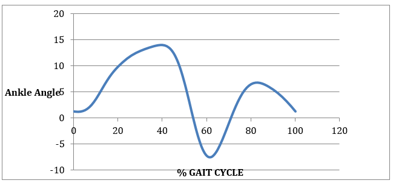

---

## What worked and what didn't

Setting this out plainly, since an archive that oversells itself is no use to anyone reading it.

**We got working:**

- Closed-loop position control of the ankle joint, following the reference trajectory
- Gait-phase detection from the toe and heel load cells, demonstrated on hardware
- A complete mechanical design with FEA behind it, manufactured into a working prototype

**The limitations are real:**

- **A cycle takes about 5 seconds**, against roughly 1 second for a person walking. The drill motor simply could not follow the trajectory any faster. This demonstrates the control concept on a bench. It is not a device anyone could walk on.
- **Motor authority is capped at 125 of 255 PWM**, about 49 percent duty. We set that ceiling deliberately to keep the improvised drivetrain from tearing itself apart. There is also a hard travel stop: outside -80 to +170 counts the motor is cut regardless of what the loop asks for.
- **There is no torque or impedance control.** The ankle tracks position and nothing else. A real prosthesis needs compliance that changes through the gait cycle; ours is stiff the whole way through.
- **It was never tested on an amputee.** All of our testing happened on the bench.

---

## What is in this repository

```
firmware/
  ankle_controller_esp32/   the final controller, ported to plain C++ sources
  original-sketches/        the 2021 .ino sketches exactly as they were written
    ankle_controller_esp32/   the final ESP32 build, the one that ran
    loadcell_bench_esp32/     load-cell isolation test: sensors on, motor loop off
    motor-test-bench/         AVR bench: motor, H-bridge, encoder, PID tuning
docs/
  graduation-book-2021-07-03.pdf                full group thesis, 111 pp.
  individual-contribution-mohamed-tawakol.docx  individual section
  project-proposal-2020.pdf
  bill-of-materials.pdf
media/
  demo/  hardware/  results/
REFERENCES.md      cited literature, by DOI
```

### One thing worth explaining before you go looking

**The book says Arduino Uno; the code says ESP32.** The electrical chapter of the graduation book describes an "Arduino Uno ATmega328" as the main board, and the bill of materials lists one. That chapter was written before we moved to the ESP32 and never revised afterwards. Trust the firmware and the second wiring diagram: the final controller is an ESP32. We used the same IDE for both boards, which is probably where the confusion started.

While you are at it, note that `firmware/original-sketches/motor-test-bench/FINAL_PID_CODE_WITH_RTOS/` has "FINAL" in its name but includes `Arduino_FreeRTOS.h` and calls `analogWrite()`, both of which are AVR-only. The name is misleading: it is the final *bench* controller, the last milestone before the ESP32 build, not the final firmware.

### About the commit history

The first commit holds the 2021 files exactly as they were archived. Two later commits change behaviour: one re-enables the load cell tasks in `setup()`, and the port commit restores the gait-phase state machine inside `TrajGen`. Both had been commented out in the saved file, leaving a build where the load cells ran without affecting motion.

Keeping the archived state as the first commit means the history shows what was found as well as what was changed. The WiFi credentials are the one exception: they were redacted throughout, including in history.

---

## The team

B.Sc. Mechatronics Engineering, AASTMT College of Engineering and Technology, Cairo, 2021.

- **Mohamed Ahmed Mohamed Tawakol** ([@Tawakoll](https://github.com/Tawakoll))
- Ahmed Mohamed Ahmed Mokhtar
- Amr Samir Hassanein Mohamed
- Ibrahim Ayman Ibrahim El-Shimi

Supervised by Dr. Ahmed Elsawaf and Dr. Moustafa A. Fouz.

### Contributions

Everything in this repository that is software, control or electronics is the work of **Mohamed Tawakol**: the firmware and its FreeRTOS task design, the PID loop and its tuning, the motor test bench, sensor integration and the circuit design.

The project as a whole was a four-person effort. The mechanical design, manufacturing and the written thesis were shared across the team, and the graduation book carries all four names.

Sponsored by the Academy of Scientific Research and Technology (ASRT), Egypt.

---

## Licence

The code under `firmware/` is [MIT](LICENSE). The documents and media under `docs/` and `media/` are [CC BY-NC 4.0](LICENSE-DOCS).

Papers we read during the project are not redistributed here. [REFERENCES.md](REFERENCES.md) lists them with DOIs.
