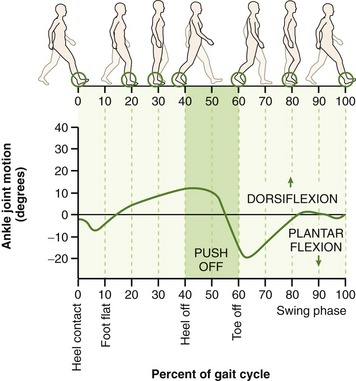

# Active Ankle Prosthesis

> **Archived academic project — 2021.** This is the B.Sc. graduation project of four Mechatronics Engineering students at the Arab Academy for Science, Technology & Maritime Transport (AASTMT), Cairo. It is preserved here as a record of the work. It is not maintained, and it is not a medical device.

A powered (active) transtibial ankle prosthesis: a ball-screw-driven ankle joint under closed-loop position control, with foot-mounted load cells detecting where in the gait cycle the wearer is, and the ankle tracking a reference ankle-angle trajectory in response.

**This project won a sponsorship scholarship from the Academy of Scientific Research and Technology (ASRT), Egypt**, awarded to the team to fund the build.

---

## Why

Most below-knee amputees in the MENA region walk on *passive* prostheses — a spring and a hinge. A passive ankle returns some energy but generates none, so stairs, inclines and long walks cost the wearer significantly more effort, and the asymmetric gait causes secondary problems over time. Commercial active ankles exist, but import duties and regional pricing put them out of reach for most amputees here.

The goal of this project was a powered ankle that could plausibly be built and afforded locally.

---

## Demo

[`media/demo/gait-cycle-demo.webm`](media/demo/gait-cycle-demo.webm) — the ankle tracking one full gait cycle.

| | |
|---|---|
|  |  |

---

## How it works

### Mechanical

A DC motor drives an **SFU1605 ball screw**, which converts rotation into linear travel and drives the ankle joint through the foot linkage. An **SKF 6002** bearing carries the joint. The structural parts were checked in Autodesk Inventor (Von Mises stress, displacement, contact pressure) before manufacture — the analysis is in the graduation book.

The motor is a **repurposed cordless drill motor**. A brushless motor with the right torque-to-size ratio was not obtainable within the project's budget and timeline, so the team improvised. This is the single biggest constraint on the system's performance, and most of the limitations below follow from it.

### Sensing

| Sensor | Purpose |
|---|---|
| **AS5600** magnetic rotary encoder (I²C) | Joint position — absolute within a turn, with software revolution counting for multi-turn travel |
| **4 × load cells** via HX711 amplifiers | Ground contact: 2 under the toe, 2 under the heel |
| **Current sensor** | Motor current, used for characterisation and to keep the motor inside safe limits |

Toe and heel contact together identify the gait phase — heel strike, flat foot, toe off, swing — which is what tells the controller where in the cycle the wearer actually is.

### Control

An **ESP32** runs the controller as concurrent **FreeRTOS** tasks (via `TridentTD_EasyFreeRTOS32`), one per concern:

```
TrajGen      → steps through the reference trajectory, advancing on gait phase
read_ANGLE   → reads the AS5600, accumulates revolutions, converts to degrees
pid          → PID position loop, drives motor PWM + direction
toe_cells    → 2× HX711, toe contact, threshold = 400
heel_cells   → 2× HX711, heel contact, threshold = 400
Communication→ serial telemetry and live gain tuning
```

The position loop is a straightforward **PID** on joint angle, tuned empirically to **Kp = 0.14, Ki = 0.2, Kd = 0** (see [`media/results/`](media/results) for the step responses at each gain). Motor output is PWM with a separate direction pin.

#### A note on the trajectory units

`WalkingTraj[101]` holds the reference trajectory — 101 samples spanning one gait cycle, derived from published human ankle kinematics.

**The values are in encoder-shaft degrees, not ankle joint degrees.** The conversion in firmware is:

```c
raw = revolution * 4096 + raw_angle;   // AS5600 is 12-bit → 4096 counts/turn
ang = raw * 0.087;                     // 360/4096 ≈ 0.0879 deg/count
```

So the range of roughly −74 to +156 is motor-side travel, which maps to the anatomical ankle range (about −20° plantarflexion to +10° dorsiflexion) through the ball screw and foot linkage. If you read the array expecting joint angles, the numbers will look impossible — they aren't.

---

## What worked, and what didn't

Stated plainly, because a project archive that oversells itself is worthless to anyone reading it.

**Worked:**
- Closed-loop position control of the ankle joint, tracking the reference trajectory
- Gait-phase detection from toe and heel load cells, demonstrated on hardware
- Full mechanical design, FEA, and a manufactured working prototype

**Limitations:**
- **Cycle time ≈ 5 s**, against roughly 1 s for real human walking. The drill motor could not track the trajectory any faster. This is a bench demonstration of the control concept, not a walkable device.
- **Motor authority capped at ±100 of 255 PWM** (≈39% duty) — a deliberate ceiling to protect the improvised drivetrain from mechanical failure.
- **No torque or impedance control.** The ankle tracks position only. A real prosthesis needs compliance that varies through the gait cycle; this one is stiff throughout.
- **Never tested on an amputee.** All testing was on the bench.

---

## Repository layout

```
firmware/
  esp32-final/     shimi/     — the final ESP32 build (the one that ran)
  esp32-bench/     trial_code/— load-cell isolation test: sensors on, motor loop off
  arduino-avr/                — earlier AVR-based development sketches
docs/
  graduation-book-2021-07-03.pdf              — full group thesis (111 pp.)
  individual-contribution-mohamed-tawakol.docx— individual section
  project-proposal-2020.pdf
  bill-of-materials.pdf
media/
  demo/  hardware/  results/
REFERENCES.md      — cited literature, by DOI
```

### Two things that will confuse you if unexplained

**The `shimi` folder name.** It is named after team member Ibrahim El-Shimi, not after any component. It is the final firmware.

**The book says Arduino Uno; the code says ESP32.** The electrical chapter of the graduation book describes an "Arduino Uno ATmega328" as the main board. That chapter was written early and never revised after the team migrated to the ESP32 for its extra I/O, speed and WiFi. **The firmware in this repository is the ground truth: the final controller is an ESP32.** Development was done in the Arduino IDE throughout, which is the likely source of the confusion.

Note also that `firmware/arduino-avr/FINAL_PID_CODE_WITH_RTOS/` is named "FINAL" but includes `Arduino_FreeRTOS.h` and uses `analogWrite()` — both AVR-only. Despite the name, it is an earlier development milestone, not the final build.

### Commit history

The first commit preserves the 2021 files exactly as they were archived. The second re-enables the gait-phase tasks in `shimi.ino`, which had been commented out during a test session and left that way in the saved file. Both states are kept in history so the archive stays honest.

---

## Team

B.Sc. Mechatronics Engineering, AASTMT College of Engineering and Technology, Cairo — 2021

- Ahmed Mohamed Ahmed Mokhtar
- Amr Samir Hassanein Mohamed
- Ibrahim Ayman Ibrahim El-Shimi
- Mohamed Ahmed Mohamed Tawakol ([@Tawakoll](https://github.com/Tawakoll))

**Supervisors:** Dr. Ahmed Elsawaf · Dr. Moustafa A. Fouz

**Sponsorship:** Academy of Scientific Research and Technology (ASRT), Egypt

---

## License

- **Code** (`firmware/`) — [MIT](LICENSE)
- **Documents and media** (`docs/`, `media/`) — [CC BY-NC 4.0](LICENSE-DOCS)

Third-party papers referenced during the project are **not** redistributed here; see [REFERENCES.md](REFERENCES.md) for DOIs.
