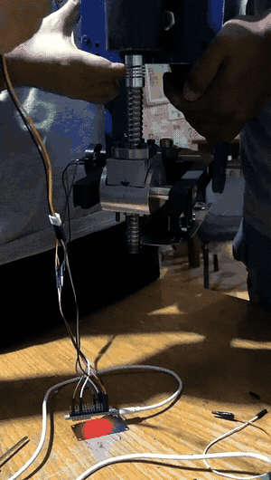
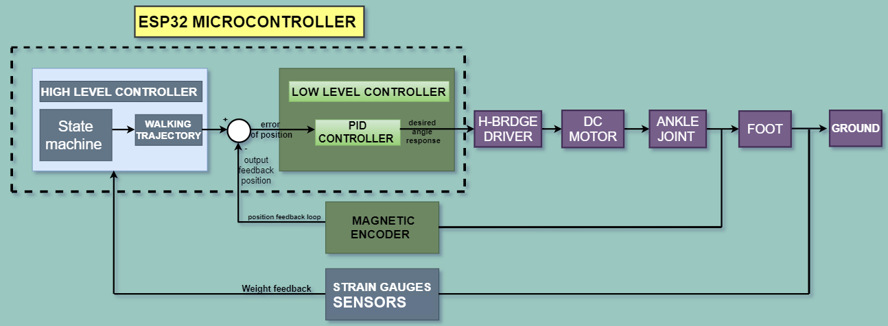

# Active Ankle Prosthesis

**A powered ankle prosthesis built by four engineering students in Cairo, from parts bought off the shelf.**
---

## The working full system

Physical hardware and the live PID trace, at the same time: a hand moving the ankle joint through the ball screw, the load-cell board lit up beneath it, and the setpoint/measured-position plot updating on the laptop in real time.



The source clip is at [`media/demo/full-system-pid.mp4`](media/demo/full-system-pid.mp4).
---
<table>
<tr>
<td width="33%" align="center"></td>
<td width="33%" align="center"></td>
<td width="33%" align="center"></td>
</tr>
<tr>
<td align="center"><i>As designed</i></td>
<td align="center"><i>As built</i></td>
<td align="center"><i>Side panel off</i></td>
</tr>
</table>

## Project Description

- Graduation project, B.Sc. Mechatronics Engineering, AASTMT, Cairo — sponsored by the **Academy of Scientific Research and Technology (ASRT)**, graded **Excellent (A+)**
- Real-time control, running as concurrent **FreeRTOS** tasks: trajectory generation, encoder read, PID loop, load-cell sampling and telemetry all run in parallel, not in one polling loop
- Controlled by an **ESP32-WROOM-32**, written in **C/C++** through the **Arduino IDE**
- Closed-loop **PID position control**, driving a DC motor through an H-bridge and ball screw to a reference angle trajectory
- Gait-phase sensing from four **load cells** (two heel, two toe) via **HX711** amplifiers, plus an **AS5600** magnetic encoder for joint position
- Built entirely from off-the-shelf parts sourced locally in Cairo, including a motor salvaged from a cordless drill

> **Archived academic project, 2021.** This was our B.Sc. graduation project in Mechatronics Engineering at the Arab Academy for Science, Technology & Maritime Transport (AASTMT), Cairo. It is kept here as a record of the work. Nobody maintains it, and it is not a medical device.

---

## Why we built it

Most below-knee amputees in the MENA region walk on passive prostheses, which amount to a spring and a hinge. A passive ankle returns some energy but generates none of its own. Stairs, slopes and long walks therefore cost the wearer far more effort, and years of asymmetric gait bring problems of their own.

Active ankles are sold commercially. Between import duties and regional pricing, they are out of reach for nearly every amputee here.

So we asked a narrow question: could we build one locally, from parts available locally, at a price that made sense locally? Everything in the components list below was bought off the shelf in Cairo, and the motor came out of a cordless drill.

---

## How it works

Control is split into two layers, the way the team's own presentation laid it out: a high-level **state machine** decides which part of the gait cycle the wearer is in, and a low-level **PID loop** drives the motor to reach the angle that phase calls for.



The encoder's feedback line taps the position loop right after the joint — it reads the shaft the motor is turning. The strain gauges' feedback line taps in from the ground side — they read the reaction force coming back up through the foot, and that feeds the state machine rather than the PID loop. Nothing here reads back through a current sensor — see the note on that below.

Reading it as a cycle:

1. **Where is the wearer in their step?** The strain gauges under the foot report weight distribution as heel and toe contact. That feeds the state machine, which is entirely what decides the gait phase, not a timer.
2. **What angle should the ankle be at?** The trajectory generator plays the segment of the reference walking trajectory that belongs to that phase, one sample at a time. Each sample is the setpoint.
3. **Get there.** The PID controller compares the setpoint against the measured position and drives the motor through the H-bridge. The output is the desired angle response, turned into PWM and a direction.
4. **Measure and repeat.** The magnetic encoder closes the position loop; the strain gauges keep telling the state machine where the next phase begins.

Every one of those steps runs as its own FreeRTOS task, so sensing, planning and control run concurrently rather than in one polling loop.

This is the team's original control-strategy diagram, from the final presentation (slides 32 and 36), with one spelling fix (**"STRAIN GAUGES SESNORS"** → **SENSORS**) and nothing else touched. It checks out exactly against the firmware: `toe_cells`/`heel_cells` set `heel_state`/`toe_state`, `TrajGen` is the state machine picking a trajectory segment from those two booleans, and `pid_control.cpp` is the summing junction and PID block driving the Cytron driver.

<details>
<summary><b>Sensing, feedback and why an ESP32</b></summary>

**Where the sensors actually are**, from the team's own photos rather than a schematic:

<table>
<tr>
<td width="50%"></td>
<td width="50%"></td>
</tr>
<tr>
<td align="center"><i>Strain gauge sensors 1–2 at the toe, 3–4 at the heel</i></td>
<td align="center"><i>AS5600 magnetic encoder, mounted at the joint</i></td>
</tr>
</table>

**Why ESP32 over the first Uno board**, from the presentation's own reasoning:

- Sufficient I/O: 2 GPIO per load cell × 4 load cells = 8 pins, 1 PWM + 1 digital for the motor driver, 2 I²C pins for the AS5600 — 12 pins in total
- WiFi and Bluetooth on-board
- 32-bit core vs. the Uno's 8-bit ATmega328
- 12-bit ADC vs. the Uno's 10-bit
- Up to 16-bit hardware PWM vs. the Uno's 8-bit `analogWrite`

One number here is worth a caveat: the presentation cites the ESP32 running at **160 MHz, "10x faster than an Arduino Uno"** (16 MHz × 10 = 160). The chip's commonly published maximum is **240 MHz** (about 15x the Uno) — 160 MHz is a real, selectable clock speed on this hardware, just not its ceiling, so "10x" understates it if the board was left at its default. Separately, the firmware's own PWM only uses 8-bit resolution (`LEDC_TIMER_13_BIT` is set to `8`, a leftover name from an earlier attempt) even though the chip can do more — the "16-bit" figure above is what the ESP32 is capable of, not what this project's motor PWM actually uses.

**On the current sensor:** the ACS712 shows up nowhere in the diagram above because it is nowhere in any control loop. It is read in exactly two places, both standalone bench sketches for characterising the motor (`CURRENT_SENSOR`, `CURRENT_SENSOR_motor`, in the [dc-motor-pid-tuning-bench](https://github.com/Tawakoll/dc-motor-pid-tuning-bench) repo) — neither the AVR bench's own final PID controller nor the ESP32 firmware ever reads it. It never fed a decision, on the bench or in the final build.

</details>


---

## Components

| Part | Use |
|---|---|
| RS-550S brushed DC motor | Drives the joint. Salvaged from a cordless drill. |
| Cytron MD10C H-bridge | Motor driver. |
| SFU1605 ball screw and nut | Converts motor rotation into the linear travel that moves the joint. |
| SKF 6002 bearing | Carries the ankle joint. |
| 18 V Li-ion pack | Powers the motor and, through a step-down regulator, the logic. |
| ESP32-WROOM-32 | Main controller. |
| AS5600 magnetic encoder | Joint position feedback. |
| 4× 50 kg load cells + HX711 amplifiers | Toe/heel contact, for gait-phase detection. |

---

## Control system

An **ESP32** runs the controller as concurrent **FreeRTOS** tasks (using `TridentTD_EasyFreeRTOS32`), one task per job:

```
TrajGen        steps through the reference trajectory, advancing on gait phase
read_ANGLE     reads the AS5600, counts revolutions, applies the zero offset
pid            PID position loop; drives motor PWM and direction
toe_cells      2x HX711, toe contact, threshold 400
heel_cells     2x HX711, heel contact, threshold 400
Communication  serial telemetry and live gain tuning
```

The position loop is an ordinary **PID** on joint angle, tuned empirically to **Kp = 0.14, Ki = 0.2, Kd = 0**.

`TrajGen` picks which part of the cycle to play from the two contact booleans:

| heel | toe | phase |
|---|---|---|
| 1 | 0 | heel strike, moving to flat foot |
| 1 | 1 | flat foot, moving to heel off |
| 0 | 1 | heel off, moving to toe off |
| 0 | 0 | swing |

A latch flag per phase makes each segment play once per step instead of restarting while the contact state holds.

### About the code

It is written in a procedural C style: plain functions, global state, no classes of our own. It compiles as **C++**, because the framework core and every library it uses (`PID_v1`, `HX711_ADC`, `AS5600`, `WiFi`) are C++ and are used as objects.

We built it in the **Arduino IDE**, chosen because it is free, open source and got out of the way while we were bringing hardware up. It compiles `.ino` as C++ behind the scenes, which is why the original files never had to say so.

[`firmware/ankle_controller_esp32/`](firmware/ankle_controller_esp32) holds the same code with its structure made explicit: shared state in a header, one task per source file, and a PlatformIO config so it builds from the command line. The original sketches are archived untouched in [`firmware/original-sketches/`](firmware/original-sketches).

### The test bench came first

None of the control work waited for the mechanical build. While the ankle was still being machined, we put a bench together with just the motor, the H-bridge and the encoder, and developed the PID position loop against that — tuned by hand over the serial link until the gains held a square-wave setpoint cleanly. By the time the assembled ankle existed, the loop was already tuned and the gains were known; the move to the ESP32 and the load cell array came after that, on a controller we already trusted.

That bench work — the bring-up sketches, the tuning sweep, the current-sensing characterisation — now has its own repository: [**dc-motor-pid-tuning-bench**](https://github.com/Tawakoll/dc-motor-pid-tuning-bench).

### About the trajectory units

`WalkingTraj[101]` holds the reference trajectory: 101 samples covering one gait cycle, derived from published human ankle kinematics.

**Those values are raw encoder counts, not degrees.** The loop runs directly on the count, with the joint's zero offset subtracted:

```c
raw = revolution * 4096 + raw_angle;   // AS5600 is 12-bit, so 4096 counts/turn
raw = raw - ZeroClaib;                 // measured offset of the assembled joint
```

To read the array in degrees, multiply by 360/4096, about 0.0879 degrees per count. The range of roughly -74 to +156 counts is therefore about -6.5 to +13.7 degrees at the encoder, which the ball screw and foot linkage map onto the anatomical ankle range.

Our earlier AVR build did convert to degrees in firmware (`ang = raw * 0.087`) and ran the loop on that. The line is still there in the ESP32 source, commented out. If you compare the two builds, that is the difference to watch for: the same trajectory array means counts in one and degrees in the other.

This is that same trajectory plotted in degrees, from the team's own presentation — peak of about +14°, trough of about −7°, matching the −6.5° to +13.7° range worked out above:


---

## What worked and what didn't

Setting this out plainly, since an archive that oversells itself is no use to anyone reading it.

**We got working:**

- Closed-loop position control of the ankle joint, following the reference trajectory
- Gait-phase detection from the toe and heel load cells, demonstrated on hardware
- A complete mechanical design with FEA behind it, manufactured into a working prototype

**The limitations are real:**

- **A cycle takes about 5 seconds**, against roughly 1 second for a person walking. The drill motor simply could not follow the trajectory any faster. This demonstrates the control concept on a bench. It is not a device anyone could walk on.
- **Motor authority is capped at 125 of 255 PWM**, about 49 percent duty. We set that ceiling deliberately to keep the improvised drivetrain from tearing itself apart. There is also a hard travel stop: outside -80 to +170 counts the motor is cut regardless of what the loop asks for.
- **There is no torque or impedance control.** The ankle tracks position and nothing else. A real prosthesis needs compliance that changes through the gait cycle; ours is stiff the whole way through.
- **It was never tested on an amputee.** All of our testing happened on the bench.
